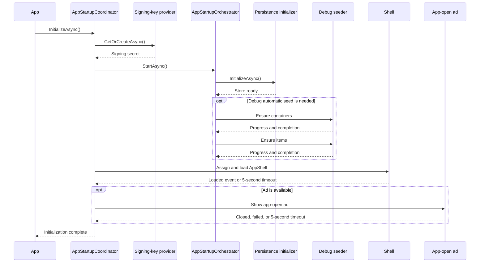
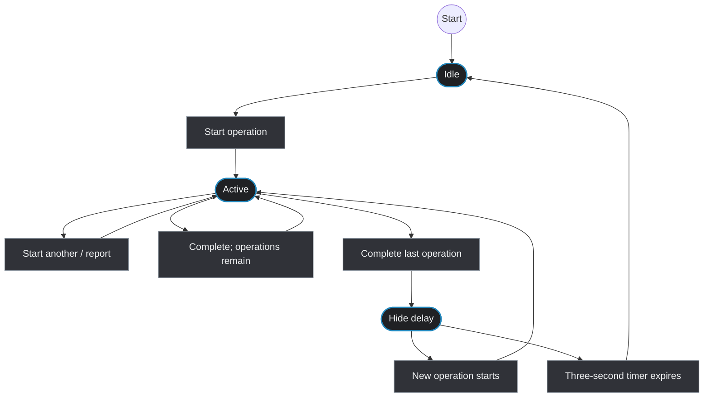

# Concurrency and Threading

This document records the asynchronous, threading, cancellation, and synchronization model of Mothball. It is an implementation map and review guide, not a promise that every operation runs on a dedicated background thread.

## Executive summary

Mothball is primarily an asynchronous, event-driven MAUI application. Most `async` methods perform asynchronous I/O and resume on whichever context their caller provides. The application does not use a general worker-thread abstraction or a global application lock.

The main coordination mechanisms are:

- MAUI `MainThread`/`Dispatcher` calls for UI-bound state and controls.
- `SemaphoreSlim` for one-time database initialization, JSON-store writes, backup-key access, barcode-scan sessions, barcode ownership, startup single-flight, and one tag-results reload at a time.
- `lock` for the photo-operation tracker and search debouncer’s small in-memory state.
- `Interlocked` request versions and cancellation-token replacement for stale-search suppression.
- `TaskCompletionSource` for event-to-task bridges such as startup, ads, modal number picking, and barcode scanning.
- A tracked fire-and-forget extension that logs background task failures.

The previous review identified five high-value risks: unbounded startup work, scanner-session gates held after disappearance, detached tag reloads, barcode registry races, and overlapping startup seeding. The mitigations and their remaining boundaries are recorded in [Review priorities and mitigations](#review-priorities-and-mitigations) below. These safeguards reduce race and hang risk but do not prove the cause of every freeze; runtime logs and targeted tests remain the preferred diagnostic tools.

## Execution model

### Application and persistence layers

Application services and persistence adapters expose `Task`-returning methods. SQLite-net and file APIs perform asynchronous I/O. Most infrastructure methods use `ConfigureAwait(false)`, which deliberately avoids requiring the MAUI synchronization context after the await. Examples include:

- `src/Infrastructure/Services/Repositories/*`
- `src/Infrastructure/Services/JsonStore/*`
- `src/Infrastructure/Services/BarcodeRegistry/*`
- `src/CoreApp.Application/Features/Backup/*`
- `src/Infrastructure.Platform.Maui/Services/MobileFileHandler.cs`

`ConfigureAwait(false)` does not create a new thread. It only changes continuation scheduling. CPU-heavy work is explicitly offloaded in two places:

- `CameraHandler.DecodePhotoAsync` uses `Task.Run` for image decoding.
- `SkiaImageMetadataReader.ReadAsync` uses `Task.Run` for image metadata inspection.

The barcode PDF generator performs rendering work synchronously inside its asynchronous workflow; it is not automatically moved to a worker thread.

### UI layer

MAUI event handlers and view-model commands generally begin on the UI thread. UI collections, bindable properties, navigation, popups, and controls must therefore be updated on the UI thread. The code uses:

- `MainThread.InvokeOnMainThreadAsync` when an operation must execute on the UI thread and be awaited.
- `MainThread.BeginInvokeOnMainThread` for queued UI publication.
- `Dispatcher.Dispatch` in `SegmentedSwitch` for a layout refresh.

Examples include `MauiPopupService`, `InventoryBackupWorkflowService`, `BackupSigningKeyTransferService`, `BarcodeScannerPage`, `PhotoDetailsViewModelBase`, list searches, tag suggestions, and `PhotoBackgroundOperationTracker`.

## Synchronization inventory

| Mechanism | Location | Purpose | Assessment |
| --- | --- | --- | --- |
| `SemaphoreSlim initLock` | `Infrastructure/Services/Database/MothballDatabase.cs` | Ensures SQLite schema/connection initialization runs once | Good double-check inside the gate; startup cancellation can interrupt a waiter; disposal assumes app-lifetime shutdown rather than concurrent use |
| `SemaphoreSlim writeLock` | `Infrastructure/Services/JsonStore/JsonInventoryStore.cs` | Serializes JSON snapshot writes, recovery, and rollback | Strong per-store-instance write serialization; reads use immutable two-slot snapshots but are not held by the write gate |
| `SemaphoreSlim synchronizationLock` | `MothballMobile/Infrastructure/Backup/BackupSignatureSecretProvider.cs` | Prevents duplicate secure/keychain secret creation or replacement | Good in-process single-flight protection; secure-storage calls have partial cancellation support |
| `SemaphoreSlim sessionGate` | `MothballMobile/Infrastructure/Scanning/BarcodeScanSession.cs` | Allows one active barcode scan | Correctly prevents overlapping scans; page disappearance now completes a pending scan with `null` |
| `SemaphoreSlim reloadGate` | `MothballMobile/UI/Features/Tags/TagResults/TagResultsViewModel.cs` | Serializes tag-result reload execution | Good stale-request design with cancellation, version checks, and observed detached entry points |
| `SemaphoreSlim initializationGate` | `MothballMobile/UI/Shared/BasePage.cs` | Prevents overlapping page initialization calls | Serializes repeated `OnAppearing`; a page-owned token cancels initialization on disappearance |
| `SemaphoreSlim` barcode-operation gate | `CoreApp.Application/Features/Barcodes/Commands/BarcodeOperationCoordinator.cs` | Serializes registry plus entity changes across barcode create/update workflows | Shared singleton gate prevents in-process check/write races; SQLite registry mutations additionally use transactions |
| `SemaphoreSlim startupGate` | `MothballMobile/Infrastructure/Startup/AppStartupOrchestrator.cs` | Prevents duplicate persistence initialization and automatic seeding | Single-flight startup; successful completion is memoized and waits accept cancellation |
| `lock (sync)` | `MothballMobile/Infrastructure/Resilience/Debouncer.cs` | Atomically replaces the current debounce CTS and handles disposal | Small critical sections; action runs outside the lock |
| `lock (gate)` | `MothballMobile/Infrastructure/BackgroundOperations/Photos/PhotoBackgroundOperationTracker.cs` | Protects active-operation dictionary and banner CTS | State protection is localized; UI publication is queued while the lock is held |
| `Interlocked` request versions | Searchable lists, item/container details, tag results, scanner | Rejects stale async results and accepts one scan result | Appropriate lock-free coordination for small scalar state |
| `TaskCompletionSource` with `RunContinuationsAsynchronously` | Startup coordinator, ad wait, barcode scan, number picker | Converts framework events/modal completion to awaitable tasks | Avoids inline continuation reentrancy; completion ownership must still be guaranteed |

There are no uses of `Monitor`, `Mutex`, `Channel<T>`, `ConcurrentDictionary`, `Parallel.*`, or `Thread.Sleep` in production code. There are no synchronous `.Wait()`, `.Result`, or `GetAwaiter().GetResult()` calls in production code.

## Fire-and-forget work

`MothballMobile/Infrastructure/Utilities/TaskExtensions.cs` defines `FireAndForget`. It observes a task with `ConfigureAwait(false)` and sends failures to `IBackgroundTaskObserver`, implemented by `LoggingBackgroundTaskObserver`.

It is used for:

- Debounced searches and tag suggestions in `SearchablePagedListViewModelBase`.
- Container and item list searches.
- Container-detail searches, suggestions, image loading, and photo persistence.
- Association searches and image loading.
- Add-existing-item image loading.

This is preferable to a completely unobserved discard because failures are logged. It still means the caller does not await completion, cannot directly cancel the operation, and usually cannot prevent the operation from finishing after its page has disappeared. The operation itself must check disposal, cancellation, or request-version state where appropriate.

`TagResultsViewModel` and `TagsListViewModel` now route detached reloads through the observer. `SegmentedSwitch` still starts animation from a property callback, but the animation task catches and logs failures so a disposed control cannot create an unobserved exception.

## Cancellation and stale-result handling

Cancellation is concentrated in interactive search and tag suggestion flows:

- `Debouncer` cancels the previous delay/action when a newer query arrives and cancels its active CTS on disposal.
- `SearchablePagedListViewModelBase` and item/container detail view models replace suggestion CTS instances with `Interlocked.Exchange`, cancel the previous request, and use a version counter before publishing results.
- `TagResultsViewModel` cancels the previous reload, waits on `reloadGate` with the new token, and checks the version before replacing `Results`.
- `BasePage` creates a lifecycle token for each initialization attempt and cancels it from `OnDisappearing`; list/detail loaders check the token between repository and image stages.
- `PhotoBackgroundOperationTracker` uses cancellation for its three-second banner-hide timer. Photo persistence is intentionally detached from page lifetime, observed through `FireAndForget`, and guarded against refreshing disposed detail state.

Cancellation remains cooperative rather than a global shutdown mechanism: repository mutation and photo-file APIs still finish an already-started operation, while page initialization, startup, search, scan, and seeding now have explicit cancellation boundaries.

Disposal generally cancels current work but does not await its completion. Short-lived suggestions and page initialization check cancellation/version state; long-running photo writes are explicitly detached, tracked, and observed so they can finish safely after navigation.

## Event handlers and `async void`

`async void` is used where MAUI requires an event or lifecycle handler:

- `BasePage.OnAppearing` and its view-model error event handler.
- `AppShell` barcode-scan event.
- `MainPage` navigation button events.
- Barcode scanner camera/gallery events.
- Number-picker modal events.

The scanner, Shell, and MainPage handlers catch their operation failures. `BasePage.OnAppearing` catches initialization failures and shows an error popup. `BasePage.OnViewModelErrorOccurred` is an `async void` event handler, so failures from popup display cannot be propagated to its raiser. This is a framework-boundary trade-off; event handlers should remain thin and delegate to testable `Task` methods.

## Startup and splash-screen concurrency

`AppStartupCoordinator.InitializeAsync` performs this sequence:

```text
secret provider -> persistence initializer -> Debug seeding -> assign AppShell -> wait for Loaded (5 s) -> optional app-open ad (5 s)
```

The lifecycle and its bounded waits can be reviewed as a UML sequence:



The Shell-loaded and ad waits use `TaskCompletionSource` with asynchronous continuations and bounded waits. A Shell `Loaded` timeout prevents a missed event from leaving the splash page permanently visible.

The startup operation has a two-minute cancellation timeout owned by `AppStartupCoordinator`; the token is forwarded through secure storage, persistence initialization/recovery, and Debug seeding:

- `BackupSignatureSecretProvider.GetOrCreateAsync` secure-storage/keychain access.
- `AppStartupOrchestrator.StartAsync` persistence initialization and recovery.
- Debug demo seeding, including 100 containers, 100 items per container, photos, barcodes, tags, and assignments.

The Debug seed is intentionally large and performs many sequential operations. On a fresh device, it can make the splash screen appear frozen even when the process is progressing. The startup page now exposes both overall startup progress and current-step progress; the seeder reports container and item generation progress within the persistence phase. Instrumentation also logs signing-key and persistence elapsed time in `AppStartupCoordinator`. After successful completion, the orchestrator stores `DemoDataSeeder.SeedVersion` in preferences and checks seed-marker/container/item counts before skipping the expensive path on subsequent startups.

`AppStartupOrchestrator` has a startup single-flight gate. Concurrent callers share one initialization attempt, and later callers return after the first successful completion. A failed or cancelled attempt does not mark startup complete, so a retry can run the workflow again.

## Persistence concurrency

### SQLite

`MothballDatabase` protects connection/schema initialization with `initLock`. Higher-level multi-row changes use `SqliteTransactionRunner` and a synchronous `SQLiteConnection` transaction body for operations that must commit together, notably item allocation and withdrawal.

Not every multi-step workflow is one database transaction. `BarcodeOperationCoordinator` now serializes barcode create/update workflows in the application process, so the inventory ownership check, registry mutation, entity persistence, and old-entry release cannot race with another in-process barcode workflow. SQLite registry reserve/assign/release operations perform their lookup and mutation inside one transaction; the registry and entity tables are still separate persistence steps, so a later entity failure is handled by the existing release compensation rather than by a cross-table transaction.

### JSON operational store

`JsonInventoryStore` serializes all `UpdateAsync`, recovery, and rollback operations with one `SemaphoreSlim`. Each update reads the active slot, mutates an in-memory state, writes the inactive slot, then writes the inactive manifest. Readers select a complete active slot and do not hold the write gate, so reads can proceed without waiting for a write.

This is safe for concurrent callers sharing the registered store instance. The lock is not inter-process and does not coordinate two independently constructed store instances pointing at the same files. The updater delegate is awaited while the write gate is held; it must remain short and must not call back into another operation that waits for the same store.

## Background photo operations

`PhotoBackgroundOperationTracker` is an in-memory state machine. Start/report/complete calls are protected by `lock (gate)`. Property and collection notifications are dispatched to the MAUI main thread. When the last operation completes, a detached three-second `Task.Run` hides the banner unless a newer operation cancels that timer.

Its visible lifecycle is shown below. Transition descriptions are intentionally separate nodes rather than labels placed on state-to-state arrows. This leaves enough space for the text in narrow and dark-mode Markdown renderers.



The tracker does not transition to a terminal error state: callers must complete tracked operations even when their persistence task fails or is cancelled.

The tracker does not own or await the actual photo persistence task. Callers start the tracker, run persistence through a tracked fire-and-forget operation, and complete the tracker from the persistence workflow. A missing completion call can leave the banner and active-operation count inconsistent. The banner timer catches cancellation, but unexpected exceptions in the detached task would not be delivered to `IBackgroundTaskObserver`.

## Review priorities and mitigations

The original review priorities are now addressed as follows:

1. Startup logs phase durations and reports overall/current-step progress for persistence and seeding.
2. Startup persistence and seeding use a two-minute cancellation timeout and a single-flight gate.
3. Scanner disappearance completes the pending `BarcodeScanSession` with `null` and releases its gate.
4. Detached tag reloads and segmented-switch animations are observed or log their failures; photo persistence is explicitly detached and tracked.
5. Barcode create/update workflows share an application-level serialization gate, and SQLite registry mutations are transactional.
6. Page initialization has lifecycle cancellation tokens; long-running photo persistence is intentionally allowed to finish after navigation and is guarded from publishing into disposed state.

If the app still freezes after inactivity or during startup, use the phase-duration logs, background-operation history, and cancellation status to identify whether the work is repository I/O, image processing, or UI publication before changing synchronization.

## Audit method and limitations

This audit used a repository-wide static search for `async`, `await`, `Task.Run`, `TaskCompletionSource`, `SemaphoreSlim`, `lock`, `Interlocked`, cancellation tokens, UI dispatch, timers, fire-and-forget helpers, blocking waits, and parallel APIs. It reviewed production implementations and relevant tests, but did not include runtime profiling, memory dumps, platform scheduler traces, or device-specific reproduction. The findings should therefore guide instrumentation and targeted tests rather than be treated as a definitive root-cause diagnosis.
