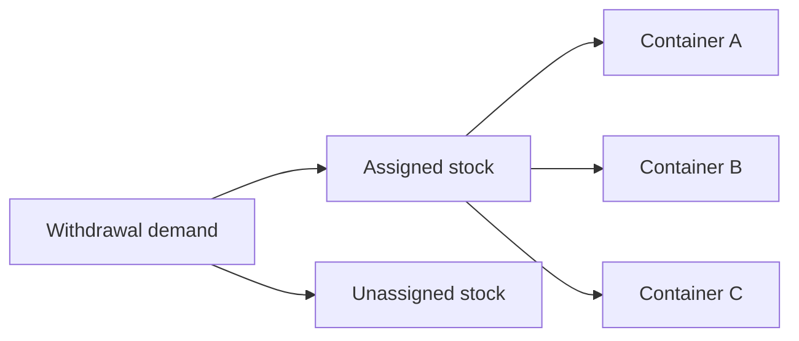

# Features and Algorithms

This guide maps Mothball's visible features to the code that implements them. It is intended for developers who need to understand a workflow before changing it. It complements [Developer Documentation](DeveloperDocumentation.md), which explains project boundaries, and [Backup and Restore](BackupRestore.md), which documents the backup format and restore policies in detail.

## Feature Map

| Area | User capability | Primary UI area | Application or infrastructure entry point |
| --- | --- | --- | --- |
| Containers | Create, search, inspect, edit, and delete storage containers | `UI/Features/Containers` | Container command and query handlers |
| Items | Create, search, inspect, edit, and delete items | `UI/Features/Items` | Item command and query handlers |
| Inventory | Assign items to containers and manage quantities | Container details, item details, association pages | Inventory allocation and withdrawal services |
| Photos | Capture/select, resize, persist, display, and delete photos | Shared photo view model base | `ImageService` and photo services |
| Backup | Export JSON or ZIP and restore it using a merge policy | Settings | Backup workflow and restore planner |
| Settings | Select theme, backup format, advanced options, and signing | Settings | `IApplicationSettings` and backup services |
| Operations | View ongoing photo work after leaving a page | Background operations | Photo background operation tracker |
| Advertising | Display test or production banner and app-open ads on supported mobile platforms | Shared page base and app startup | `AdMobSettings`, `BasePage`, and MAUI AdMob setup |
| Navigation and errors | Move between feature pages and surface failures consistently | Shell and shared UI | Typed navigation requests and error presenter |

## Containers

Containers represent physical places such as boxes, shelves, drawers, or cabinets. A container has a name, notes, and images. Item-to-container allocations are owned by the `ItemInventory` aggregate, not by `Container` itself; `Container` only exposes a read-only `ItemTypeCount`/`TotalItemQuantity` summary, hydrated by the repository layer from `ItemInventory` allocation data for display purposes.

### User workflows

- **Create** a container from the container list.
- **Search** containers by name or notes and optionally limit results to empty containers.
- **Open details** to see its items, quantities, images, notes, and distinct item-type count.
- **Edit notes**; persistence is debounced while the user types.
- **Add an existing item** or associate an item from its details screen.
- **Delete** a container through the container command handler.

### Developer map

- UI: `src/MothballMobile/UI/Features/Containers`
- Domain aggregate: `src/CoreApp.Domain/Entities/ContainerAggregate/Container.cs`
- Commands: `src/CoreApp.Application/Features/Containers/Commands`
- Queries: `src/CoreApp.Application/Features/Containers/Queries`
- Details presentation coordination: `ContainerDetailsItemsCoordinator`
- Search contract: `ContainerListSpecification`

### Search and paging algorithm

Container and item lists use `PagedListViewModelBase<TSource, TViewModel>`. A search creates a filtered result through a specification; normal browsing loads fixed-size pages.

```text
initialize:
  ensure development data when applicable
  clear displayed items
  request page 0

load next page:
  stop when the previous result was shorter than page size
  request current page
  map each source result to a row view model
  append mapped rows
  increment page number
```

The final short page, or an empty page, marks the list as exhausted. Search paths can replace the collection with a complete filtered result set, disabling further paging. This keeps incremental scrolling simple while allowing responsive, debounced search.

`ContainerListViewModel` and `ItemsListViewModel` both add debounced search on top of `PagedListViewModelBase` through a shared intermediate base, `SearchablePagedListViewModelBase<TSource, TViewModel>` (`src/MothballMobile/UI/Shared/SearchablePagedListViewModelBase.cs`). It owns the `Query` property and the debounce wiring (`OnQueryChanged`, `SearchCommand`), so a new searchable paged list only needs to implement `LoadQuerySearchAsync`, `SearchOperationName`, and the `PagedListViewModelBase` abstract members. `RefreshCommand` (`=> InitializeAsync()`) lives on `PagedListViewModelBase` itself, since every paged list — searchable or not — needs a pull-to-refresh reload. A filter change (e.g. `SelectedFilter`) should re-run the existing `SearchAsync`/`backgroundTasks` pair directly rather than duplicating the debounce logic.

## Items

Items are catalogued things that may be stored in one or more containers. Their total inventory is derived from container allocations plus any unassigned quantity.

### User workflows

- **Create** an item with a name, description, and initial quantity.
- **Search** by name or description; filter by all, assigned, or unassigned items.
- **Open details** to edit metadata, view photos, inspect allocations, change total quantity, or delete the item.
- **Open locations** to see every container holding an item and its quantity there.
- **Delete** an item and its associated inventory state.

### Developer map

- UI: `src/MothballMobile/UI/Features/Items`
- Domain aggregate: `src/CoreApp.Domain/Entities/ItemAggregate/Item.cs`
- Inventory aggregate: `src/CoreApp.Domain/Entities/InventoryAggregate/ItemInventory.cs`
- Item commands and queries: `src/CoreApp.Application/Features/Items`
- Details use-case boundary: `ItemDetailsCoordinator`
- Details withdrawal workflow: `ItemInventoryWithdrawalCoordinator`

`ItemDetailsViewModel` is presentation orchestration. Put new reusable item-detail use-case behavior in `ItemDetailsCoordinator`; keep prompt-driven state transitions in the withdrawal coordinator rather than adding more branches to the view model.

## Assignments and Inventory Quantities

An item can have allocations in multiple containers. Each allocation is a container ID plus a positive quantity. The app also supports unassigned quantity, so an item can exist before a storage location is known.

The inventory model keeps the invariant $\text{total quantity} = \text{assigned quantity} + \text{unassigned quantity}$. Quantity command services reconcile this model after allocation changes, so list rows, item details, and container details use a consistent inventory summary rather than recalculating independent totals.

### User workflows

- Add an existing unassigned item to a container.
- Associate an item with a selected container from item details.
- Increase or decrease a container allocation.
- Change an item total, withdrawing from assigned and then unassigned stock as needed.
- Consume an exact quantity from one explicitly selected container or from unassigned stock.
- View all locations and quantities for an item.

### Developer map

- Association workflow: `CoreApp.Application/Features/Containers/Association`
- Quantity changes: `CoreApp.Application/Features/Inventory/Allocation`
- Withdrawal planning: `CoreApp.Domain/Inventory/ItemInventoryWithdrawalPlanner.cs`
- Interactive withdrawal workflow: `ItemInventoryWithdrawalCoordinator`
- Source-specific consumption workflow: `ItemConsumptionCoordinator`

Editing and consumption are deliberately separate operations. Editing the total retains the target-total
workflow below, while editing a container allocation can move stock between assigned and unassigned states.
Consumption permanently reduces both the selected source and the total. It never converts consumed assigned
stock into unassigned stock and never carries a request into another source automatically.

In a general item context, consumption begins with a source picker. In a container context, the current
container is offered first but must still be confirmed; declining that prompt opens the same general source
picker, even when there is only one container allocation.

Editing a container's item quantity touches counts at two levels, and both must be refreshed from the result of the save rather than the value the user entered: `ContainerItemQuantityService.SaveQuantityAsync` returns an `ItemInventoryUpdateResult` (nested as `Inventory` on `ContainerItemQuantityUpdateResult`/`ContainerDetailsQuantityUpdate`, rather than duplicating its fields) with the item's recalculated total/assigned/unassigned quantities and removal state. `ContainerDetailsItemsCoordinator.SaveQuantityAsync` applies it to the edited row via `ItemWithImagesViewModelBase.UpdateQuantities` and refreshes the container header's item-type and total-item counts from the accompanying `ContainerDetailsSummary`, through the `IContainerDetailsHeader` seam so the coordinator does not depend on the concrete `ContainerDetailsViewModel`. Skipping either update leaves the tile or the header showing stale numbers after an edit.

### Withdrawal planning algorithm

`ItemInventoryWithdrawalPlanner` is a pure domain planner. It does not persist anything or display prompts. It validates inputs and returns the target inventory state that the coordinator can commit.

#### Simple explanation

The withdrawal process answers two questions: which stock should be removed, and how should the user confirm that removal?

An item has a total quantity, quantities assigned to containers, and any remaining unassigned quantity. The inventory invariant is:

```text
total quantity = assigned quantity + unassigned quantity
```

The process then follows these rules:

1. Remove assigned stock first.
2. Remove it from the specific containers selected by the user.
3. If a container runs out, carry the leftover amount to the next selected container.
4. Use unassigned stock only when it is needed or the user accepts the unassigned-stock prompt.
5. Return the remaining quantities.
6. Mark the item for deletion if nothing remains.

The adjustment session guides the user through these steps. The planner checks the choices and calculates the final result. The inventory aggregate applies that result.

In short:

```text
remove assigned stock
track leftovers when a container runs out
use unassigned stock separately
validate the final quantities
save or delete the item
```

#### Detailed algorithm

```text
validate total, target total, allocations, and requested withdrawals
copy allocations into mutable remaining allocations

for each assigned withdrawal:
  locate its container allocation
  remove as much as possible from that allocation
  carry any remainder to the next assigned withdrawal
  reject the plan when the remainder cannot be assigned

ensure remaining assigned quantity does not exceed the target total

for each unassigned withdrawal:
  remove up to the available unassigned quantity
  stop when the total reaches zero

return remaining allocations, assigned quantity, unassigned quantity,
       final total, and whether the item should be deleted
```

The carried remainder is important: a requested withdrawal may span multiple locations, but it must be explicitly allocated across them. This avoids silently subtracting stock from an arbitrary container. Invalid allocations, negative quantities, and plans that cannot reach the requested total are rejected before persistence.

The planner first calculates the minimum assigned withdrawal:

```text
required assigned withdrawal =
  min(current total - requested total, assigned quantity)
```

This gives assigned stock priority. For example, if the current total is 10, the requested total is 8, and five units are assigned to containers, two assigned units must be withdrawn. If the requested reduction is larger than all assigned stock, all assigned stock is withdrawn and the remainder comes from unassigned stock.

When a selected container does not contain enough stock, the planner removes what is available and carries the remainder forward:

```text
Box contains:       3
Requested from Box: 5
Removed from Box:   3
Carried amount:     2
```

The next assigned withdrawal must be at least two. This is an interactive sequencing rule: the system does not silently choose another container to satisfy the remainder.

After assigned withdrawals, the session builds a temporary target total:

```text
staged total = max(requested total, current total - assigned withdrawn)
```

This prevents the planner from claiming that the item has reached a lower total than the assigned withdrawals justify. Any difference between the staged total and the remaining assigned quantity is represented as unassigned quantity.

The planner then applies each unassigned withdrawal to the available unassigned quantity. It caps each withdrawal at what is available and stops when the total reaches zero. A zero final total produces a deletion plan rather than an item with zero quantity.

#### Graph interpretation

The same calculation can be viewed as a capacity-flow problem. Each container is a source node whose capacity is its available quantity, and unassigned stock is another source node. A withdrawal is the demand that must be supplied by those sources.



This graph view is useful if the application later needs to optimize choices, such as preferring the fewest containers, the nearest containers, or containers with the earliest expiration dates. A min-cost flow algorithm could then select the cheapest valid distribution.

For the current workflow, however, a graph does not simplify the main interaction. The user explicitly selects containers, and an over-sized selection creates a carried remainder that the user must assign next. A normal flow algorithm would distribute the withdrawal automatically and would remove that confirmation step. The current design therefore remains intentionally split:

- `ItemInventory` stores inventory invariants and applies the completed plan.
- `ItemInventoryWithdrawalPlanner` validates capacities and calculates the result.
- `ItemInventoryAdjustmentSession` manages user choices and carried remainders.
- `ItemInventoryWithdrawalCoordinator` displays prompts and passes answers to the session.

This is best understood as an ordered capacity-allocation algorithm with an interactive state machine, rather than as a general graph algorithm.

For new withdrawal rules, change or extend the planner first and add scenario tests in `ItemInventoryWithdrawalPlannerTests`. The UI coordinator should only collect selections and commit the resulting plan.

## Photos and Background Operations

Items and containers can have photos sourced from the camera or image picker. Photos are resized and stored locally, while image metadata is persisted through repository contracts.

### User workflows

- Select or capture a photo from item or container details.
- See staged progress for long-running photo work.
- Navigate away while processing continues.
- Open Background Operations to see active work.
- Delete an image reference and its stored file.

### Developer map

- Shared UI behavior: `UI/Shared/PhotoDetailsViewModelBase.cs`
- Image workflow: `CoreApp.Application/Features/Photos/ImageService.cs`
- Cleanup: `PhotoDeletionService` and file-persistence services
- Platform source access: `Infrastructure.Platform.Maui/Services`
- Global progress: `Infrastructure/BackgroundOperations/Photos`

### Photo persistence algorithm

```text
obtain a source stream from camera or picker
decode and resize the image
save the output file
write image metadata through the persistence contract

if metadata persistence fails:
  remove the in-memory image reference
  attempt to delete the newly saved file
  rethrow the failure
```

The compensation step prevents an orphan file when database or JSON persistence fails after a successful file write. Progress is deliberately staged around load, transform, and save because the image library does not expose safe fine-grained pixel progress callbacks.

## Search, Debouncing, and Retry

Search boxes and editable text should not trigger persistence or queries for every keystroke. `Debouncer` implements trailing-edge behavior: only the most recent request that remains quiet for the configured delay is executed.

### Debounce algorithm

```text
on each request:
  lock shared state
  cancel and dispose the previous cancellation source
  create a token linked to the caller token

wait for the configured delay
if canceled, stop
otherwise execute the latest action

when complete:
  clear the shared token only if it is still this request's token
```

The identity check in cleanup prevents an older operation from clearing the cancellation token for a newer request. Disposal cancels any pending action. Use this for trailing search and delayed updates; do not use it for commands that must execute every time, such as a quantity adjustment.

View models wire the debounce the same way: a generated `partial void On<Property>Changed` hook (e.g. `OnQueryChanged`, `OnSearchQueryChanged`) calls `debouncer.DebounceAsync(_ => MainThread.InvokeOnMainThreadAsync(SearchAsync)).FireAndForget(backgroundTasks, "...")`. Prefer that hook over manually subscribing to `PropertyChanged` in the constructor — it is what `ContainerListViewModel`, `ItemsListViewModel`, and `ContainerDetailsViewModel` all do.

For a "confirm, then act" command (delete container/item/photo/backup, remove from container), use `IPopupService.ConfirmAndRunAsync(definition, action)` (`src/MothballMobile/Infrastructure/Presentation/Popups/PopupServiceExtensions.cs`) instead of hand-rolling `if (!await popup.ConfirmAsync(...)) return;`. It only fits when the action should run solely on confirmation; branches that run shared code regardless of the answer should keep using `ConfirmAsync` directly.

Relevant code:

- `src/MothballMobile/Infrastructure/Resilience/Debouncer.cs`
- `src/MothballMobile/Infrastructure/Resilience/RetryService.cs`
- `src/MothballMobile/UI/Shared/PagedListViewModelBase.cs`

## Backup and Restore

Mothball can export JSON metadata or a ZIP archive containing metadata and available photo files. Backups include containers, items, allocation relations, image references, version metadata, and integrity data.

### User workflows

- Select JSON or ZIP export in Settings.
- Export a dated JSON or ZIP backup to the app's `Backups` folder.
- Share a selected local backup through the platform share sheet.
- Restore a selected local backup or import a JSON/ZIP file from the device file system.
- Select a conflict policy before an import or restore.
- Optionally enable backup signing keys for HMAC verification.

### Developer map

- UI orchestration: `MothballMobile/Infrastructure/Backup/InventoryBackupWorkflowService.cs`
- Export: `CoreApp.Application/Features/Backup/Export`
- Archive handling: `CoreApp.Application/Features/Backup/Archive`
- Restore planner: `CoreApp.Application/Features/Backup/Restore/Planning`
- SQLite atomic implementation: `Infrastructure/Services/Restore/SqliteInventoryBackupRestoreService.cs`
- Detailed contract and policy reference: [Backup and Restore](BackupRestore.md)

### Export, sharing, and import flow

The Settings screen keeps file selection and confirmation in the UI, while `InventoryBackupWorkflowService` owns the reusable file workflow:

```text
export:
  obtain the optional signing secret when signing is enabled
  export JSON or ZIP through the application exporter
  save it as mothball-backup-{UTC timestamp}.json or .zip in Backups

share:
  select a local backup file
  resolve its app-data path
  invoke the platform share sheet on the UI thread

import:
  ask the user for a restore policy
  read a selected local backup or a picker-provided external file
  dispatch JSON to RestoreJsonAsync or ZIP bytes to RestoreZipAsync
  display the restore result or a user-facing failure
```

External file import intentionally reuses the same restore methods as app-local backups. File selection is not a second restore implementation. This keeps integrity validation, signature lookup, merge policy handling, and backend behavior identical regardless of where the file originated.

### Restore planning algorithm

Restore separates **planning** from **execution**. The planner receives backup data and a snapshot of existing state, then emits inserts, updates, deletes, and skip counters. This gives the generic and SQLite restore services the same policy decisions.

```text
parse payload and validate payload/schema versions
verify required checksum and optional HMAC signature
load existing containers, items, relations, and image references

for backup containers and items:
  insert missing roots
  update existing metadata only when the policy permits it

if policy deletes missing roots:
  schedule existing roots absent from the backup for deletion
  restrict known child owners to surviving roots

normalize children:
  discard non-positive relations
  discard relations or images whose owners do not exist

apply child strategy:
  additive: add missing quantities and image references
  exact: insert, set, or delete relations and images to match backup

return the plan and result counters
```

`AddOnly` is non-destructive. `AddAndUpsertMetadata` also updates root metadata. `FullSync` deletes roots not present in the backup but leaves surviving children additive. `StrictFullSync` uses exact child reconciliation as well. See [Backup and Restore](BackupRestore.md) before changing these semantics; they are compatibility-sensitive.

SQLite execution applies the plan in one transaction. The backend-agnostic implementation executes through application repository contracts, allowing the JSON backend to reuse the same plan.

## JSON Operational Store and Recovery

The JSON backend is an operational store rather than a single mutable JSON file. It keeps two data slots and two manifest files so a partial write does not destroy the last known-good state.

### Commit and recovery overview

```text
commit:
  write a complete new state to the inactive slot
  verify the slot is complete
  write a next-generation manifest pointing to that slot
  alternate manifest files on successive generations

startup recovery:
  read both manifest candidates
  reject unreadable or structurally invalid manifests
  verify each candidate's current and previous slots
  select the highest-generation usable manifest
  use its current slot when complete
  otherwise synthesize a rollback to its previous complete slot
```

This is a small two-phase protocol: state data becomes complete before a manifest makes it active. If power loss or an exception interrupts a commit, startup can choose an older valid manifest or fall back to the prior slot. The implementation does not try to repair arbitrary corrupt data; it prefers a verified complete state.

Relevant code:

- `src/Infrastructure/Services/JsonStore/JsonInventoryStore.cs`
- `src/Infrastructure/Services/JsonStore/JsonStoreManifestManager.cs`
- `src/Infrastructure/Services/JsonStore/JsonInventoryStore.State.cs`
- `src/Infrastructure/Services/JsonStore/JsonInventoryStore.Storage.cs`
- Detailed operational format: [JSON Operational Store](JsonStore.md)

When changing JSON state shape, update row models, repository behavior, slot-completeness validation, and tests for normal commits plus recovery paths. Verify equivalent externally observable behavior in SQLite where the application contract is shared.

## Settings, Startup, and Application State

Settings currently cover theme preference, backup format, advanced mode, and backup signing. They are surfaced from `SettingsViewModel` and stored through `IApplicationSettings`.

Startup is coordinated through `IAppStartupOrchestrator`. It initializes the selected persistence backend and any startup work before the app shows the main shell. Startup failures use a retryable startup error experience rather than allowing a partially initialized app to proceed.

Relevant code:

- `src/MothballMobile/UI/Features/Settings`
- `src/MothballMobile/Infrastructure/Settings`
- `src/MothballMobile/Infrastructure/Startup`
- `src/MothballMobile/App.xaml.cs`

Development builds may seed demo data. The seeder identifies its own containers with a fixed marker token, so normal user-created containers remain untouched. See [Seeding](Seeding.md).

## Advertising

Mobile builds on iOS and Android initialize the AdMob plugin at app startup. `BasePage` wraps ordinary page content in a two-row layout and reserves the lower row for a banner. A development placeholder remains visible until an ad loads and returns if the ad fails to load, so page layout remains stable during ad lifecycle changes.

```text
application startup:
  initialize AdMob on supported platforms
  load AdMob settings
  use Google's test IDs in Debug
  use validated packaged production IDs in Release

page load / handler creation:
  wrap page content once with a banner host
  create a banner from configured banner ID
  hide the placeholder after a successful load
  show the placeholder after a load failure
```

`AdMobSettings` uses test IDs in Debug and requires valid packaged app-open and banner IDs for iOS/Android Release builds. Other targets receive empty settings and do not add the banner. See [AdMob Configuration](AdMobConfiguration.md) for the required Release files and CI setup.

## Navigation and Error Handling

View models navigate through `INavigationService`. Callers construct an `INavigationRequest` record rather than a `Dictionary<string, object>`. The navigation service converts the request to a dictionary only at the MAUI Shell boundary, which keeps route keys and parameter serialization out of feature code.

```text
view model creates a typed request record
  -> INavigationService converts it to Shell parameters
  -> Shell navigates to the route
  -> destination reads the resolved route parameters
```

`BaseViewModel.RunCommandAsync` is the shared command envelope. It marks the view model busy, clears stale errors, runs the action, captures a user-displayable failure message, emits `ErrorOccurred`, rethrows for command semantics, and finally restores the busy state. `BasePage` forwards the event to the singleton `IAppErrorPresenter`, and `AppShell` displays a dismissible banner.

Relevant code:

- `src/MothballMobile/Infrastructure/Navigation`
- `src/MothballMobile/UI/Shared/BaseViewModel.cs`
- `src/MothballMobile/UI/Shared/BasePage.cs`
- `src/MothballMobile/Infrastructure/Presentation/Errors`
- `src/MothballMobile/AppShell.xaml`

When adding a parameterized route, define a request record, add serialization tests, and preserve Shell conversion as an infrastructure concern. Do not introduce direct `Shell.Current` calls in view models.

## Persistence Backends and Extension Rules

SQLite is the default backend. The JSON operational store can be selected with `MOTHBALL_PERSISTENCE_BACKEND=Json` (or `JsonOperationalStore`). Both implement the application repository contracts.

For a data feature that must work in both modes:

1. Put invariants in Domain when they are format independent.
2. Add the application contract or use-case behavior in Application.
3. Implement equivalent SQLite and JSON behavior.
4. Include the data in backup/export and restore if it is portable.
5. Add focused behavior tests and backend-parity coverage.

Do not expose SQLite row models, JSON row models, MAUI APIs, or Shell dictionaries across these boundaries. The project uses those restrictions to keep its feature algorithms testable outside the mobile runtime.

## Testing the Algorithms

| Concern | Primary test location |
| --- | --- |
| Withdrawal validation and invariants | `tests/UnitTests/CoreApp/Features/Inventory/ItemInventoryWithdrawalPlannerTests.cs` |
| Backup planning and integrity | `tests/UnitTests/CoreApp/Features/Backup/InventoryBackupRestorePlannerTests.cs` |
| JSON commit and recovery | `tests/IntegrationTests/Infrastructure/Persistence/JsonOperationalStoreTests.cs` |
| Backend parity | `tests/IntegrationTests/Infrastructure/Persistence/BackendParityTests.cs` |
| Navigation request serialization | `tests/UnitTests/MothballMobile/Infrastructure/Navigation/NavigationRequestTests.cs` |
| Shared command error state | `tests/UnitTests/MothballMobile/UI/Shared/BaseViewModelTests.cs` |
| Error presentation | `tests/UnitTests/MothballMobile/Infrastructure/Presentation/Errors/AppErrorPresenterTests.cs` |
| ZIP archive restore | `tests/UnitTests/CoreApp/Features/Backup/InventoryBackupZipRestoreServiceTests.cs` |

Run the relevant focused tests during an algorithm change, then run the full project suite:

```bash
dotnet test Mothball.Tests.slnf -v minimal
```
