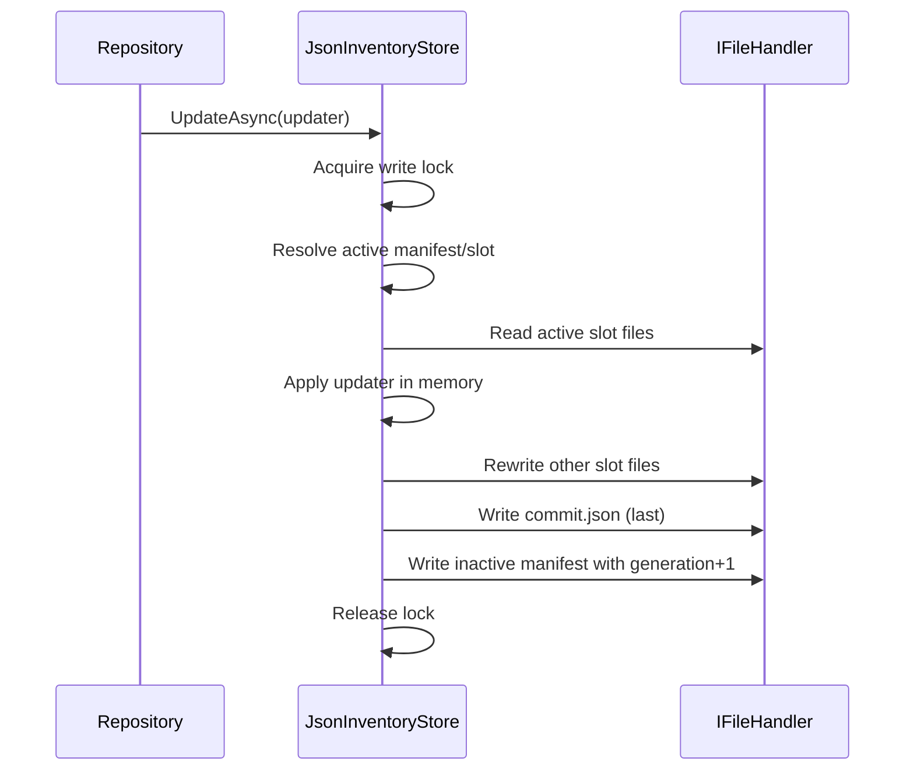
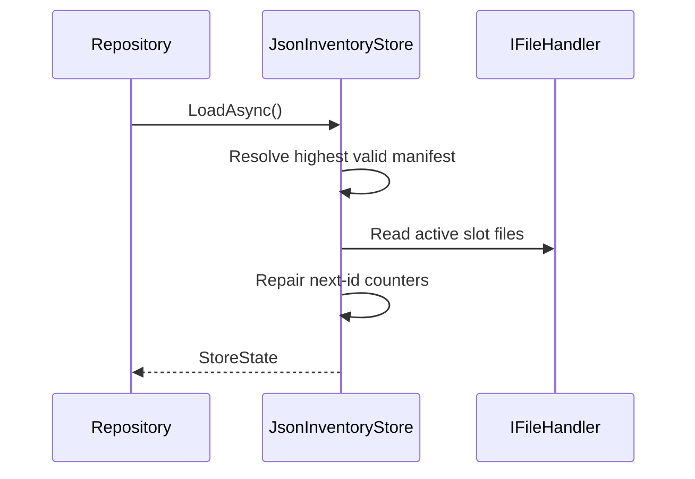

# JSON Operational Store in Mothball

## Purpose

The JSON operational store is an alternative persistence backend that emulates the repository behavior of the SQLite backend while storing data as JSON files.

It is designed to provide:

- Multi-entity persistence (containers, items, images, relations)
- Atomic-like commits using a two-slot strategy
- Startup recovery and last-commit rollback
- Test-friendly operation through `IFileHandler` abstraction

Core implementation:

- `src/Infrastructure/Services/JsonStore/JsonInventoryStore.cs`
- `src/Infrastructure/Services/JsonStore/Repositories/*.cs`
- `src/Infrastructure/Services/JsonStore/JsonStoreStartupInitializer.cs`
- `src/Infrastructure/Services/JsonStore/JsonInventoryMaintenanceService.cs`

---

## How To Enable It

Backend selection is configuration-driven in `MothballMobile`.

- Config key: `Persistence:Backend`
- SQLite value: `SQLite`
- JSON value: `Json` (also accepts `JsonOperationalStore`)

Relevant files:

- `src/MothballMobile/Composition/PersistenceConfiguration.cs`
- `src/MothballMobile/Composition/ServiceCollectionExtensions.cs`
- `src/MothballMobile/MauiProgram.cs`

By default, `MauiProgram` sets backend to SQLite unless environment variable `MOTHBALL_PERSISTENCE_BACKEND` is set.

Example:

```bash
MOTHBALL_PERSISTENCE_BACKEND=Json
```

When JSON backend is active, DI registers:

- `JsonInventoryStore` as singleton
- `JsonStoreStartupInitializer` as `IAppStartupInitializer`
- `JsonInventoryMaintenanceService` as `IInventoryMaintenanceService`
- JSON repository implementations for container/item/image/relation repository interfaces

---

## Startup Lifecycle

Startup flow:

1. `AppStartupOrchestrator.StartAsync()` calls `IAppStartupInitializer.InitializeAsync()`.
2. In JSON mode, `JsonStoreStartupInitializer.InitializeAsync()` calls `JsonInventoryStore.TryRecoverAsync()`.
3. If recovery fails, startup initializer throws and app startup is considered failed.

This ensures there is always at least one readable slot+manifest before normal repository operations.

---

## Public API Surface

`JsonInventoryStore` exposes four primary methods:

- `TryRecoverAsync()`
  - Ensures store bootstrap/recovery.
  - Creates an empty initial state if no valid manifest/slot exists.
- `TryRollbackLastCommitAsync()`
  - Switches active slot back to previous slot via a new manifest generation.
- `LoadAsync()`
  - Reads current active slot into memory.
  - Performs best-effort auto-recovery if needed.
- `UpdateAsync(Func<StoreState, Task> updater)`
  - Single-writer mutation path.
  - Reads active state, applies update callback, writes next slot and manifest.

Maintenance wrapper:

- `JsonInventoryMaintenanceService` forwards:
  - `TryRecoverAsync()`
  - `TryRollbackLastCommitAsync()`

---

## Physical Layout

Root location:

- `Path.Combine(Constants.PathToData, "OperationalStore")`

Slots:

- `slotA`
- `slotB`

Top-level manifests:

- `manifestA.json`
- `manifestB.json`

Each slot contains:

- `metadata.json`
- `commit.json`
- `containers.json`
- `items.json`
- `images.json`
- `relations.json`

Expected completeness rule: a slot is considered complete only if all files above are readable.

---

## Data Model (On-Disk JSON)

Serializer configuration:

- `System.Text.Json`
- camelCase property names
- no indentation

### manifestA/manifestB

`JsonStoreManifest`:

- `generation` (int)
- `currentSlot` (`"A"` or `"B"`)
- `previousSlot` (`"A"` or `"B"`)
- `schemaVersion` (int)

### metadata

`JsonStoreMetadata`:

- `schemaVersion`
- `nextContainerRowId`
- `nextItemRowId`
- `nextImageRowId`
- `nextRelationId`

### commit

`JsonStoreCommitInfo`:

- `generation`
- `commitId` (GUID)
- `committedUtc` (DateTimeOffset)

### table files

- `containers.json`: list of `JsonContainerRow`, including optional `barcodeValue` and `barcodeSymbology`
- `items.json`: list of `JsonItemRow`, including optional `barcodeValue` and `barcodeSymbology`
- `images.json`: list of `JsonImageRow`
- `relations.json`: list of `JsonRelationRow`

Row IDs are used for deterministic ordering and pagination parity with current SQLite behavior.

### Example JSON payloads

These examples reflect the actual serializer settings (camelCase, compact output).

#### Example manifestA.json

```json
{"generation":12,"currentSlot":"B","previousSlot":"A","schemaVersion":1}
```

#### Example metadata.json

```json
{"schemaVersion":1,"nextContainerRowId":27,"nextItemRowId":140,"nextImageRowId":81,"nextRelationId":212}
```

#### Example commit.json

```json
{"generation":12,"commitId":"1f8f8c20-aad5-4dcf-bcd6-5f74f8587f70","committedUtc":"2026-08-09T10:22:11.153892+00:00"}
```

#### Example containers.json

```json
[{"rowId":1,"containerId":"6ec1f1ea-f52b-4b4e-bca3-8d589ce4d3d8","name":"Garage Shelf A","notes":"Top-left bin stack","barcodeValue":"BOX-001","barcodeSymbology":6}]
```

#### Example items.json

```json
[{"rowId":1,"itemId":"f8f21693-d4d3-4821-9ba7-96cb8aee0a99","name":"Zip Ties","description":"Black, 8 inch","barcodeValue":"WIDGET-001","barcodeSymbology":6}]
```

#### Example images.json

```json
[{"rowId":1,"imageId":"20d79898-4d22-4fb5-9792-c35aa13e09ba","ownerUniqueId":"f8f21693-d4d3-4821-9ba7-96cb8aee0a99","imageDataBase64":null}]
```

#### Example relations.json

```json
[{"id":1,"itemId":"f8f21693-d4d3-4821-9ba7-96cb8aee0a99","containerId":"6ec1f1ea-f52b-4b4e-bca3-8d589ce4d3d8","quantity":50}]
```

#### Example empty first-run slot

After a clean first recovery, a slot typically looks like this shape:

```json
// metadata.json
{"schemaVersion":1,"nextContainerRowId":1,"nextItemRowId":1,"nextImageRowId":1,"nextRelationId":1}
```

```json
// containers.json, items.json, images.json, relations.json
[]
```

---

## Internal Commit Algorithm

`UpdateAsync` uses a two-slot generation switch:

1. Acquire `SemaphoreSlim` write lock (single writer).
2. Resolve active manifest/slot.
3. Load current slot state.
4. Run caller updater function in memory.
5. Pick next slot as opposite of current (`A` <-> `B`).
6. Increment generation.
7. Rewrite next slot files:
   - Best-effort delete existing `*.json` in next slot.
   - Write metadata/table files.
   - Write `commit.json` last.
8. Write new manifest to inactive manifest file.
9. Release lock.

Behavioral intent:

- Slot becomes self-contained before manifest points to it.
- Last valid generation manifest determines active view.
- Previous slot reference allows quick rollback.

---

## Manifest Selection and Recovery Logic

Active manifest resolution (`TryGetActiveManifestAsync`) works as follows:

1. Try read `manifestA` and `manifestB`.
2. Discard manifest candidates that fail structural validation:
   - `generation > 0`
   - slots must be `A` or `B`
3. For each candidate, check slot completeness for both `currentSlot` and `previousSlot`.
4. Pick highest `generation` candidate.
5. If neither slot is complete, treat as unusable.
6. If current slot complete, use manifest as-is.
7. If current incomplete but previous complete, synthesize rollback view by swapping current/previous (same generation).

This allows best-effort continuation when latest commit was interrupted after manifest update or slot write corruption.

---

## Bootstrapping and First Run

`TryRecoverAsync()` ensures the store exists:

- If active manifest already exists and resolves, returns `true`.
- Otherwise (under lock):
  - Creates empty `StoreState`.
  - Writes empty state into slot `A` with generation 1.
  - Writes `manifestA.json` pointing current/previous to `A`.
  - Returns `true` on success, `false` on failure.

`LoadAsync()` is defensive and will call `TryRecoverAsync()` automatically if no active manifest is found.

---

## Rollback Behavior

`TryRollbackLastCommitAsync()`:

1. Acquire write lock.
2. Resolve active manifest.
3. If `previousSlot == currentSlot`, return `false` (nothing to rollback).
4. Create rollback manifest with:
   - generation + 1
   - current = previous
   - previous = current
5. Write rollback manifest to inactive manifest file.
6. Return `true`.

Important note:

- Rollback is metadata-only (manifest pointer switch).
- No file copying is performed.

---

## Read Path Details

`ReadSlotAsync` loads all slot files and applies resilience rules:

- Missing table files are treated as empty lists.
- Missing metadata produces default metadata.
- Next-ID counters are repaired to at least `max(existing row id) + 1` for each table.

This guards against stale metadata and keeps subsequent inserts valid.

---

## Repository Semantics on Top of the Store

JSON repositories mirror current SQLite-oriented behavior as closely as possible.

Highlights:

- Container/item/image updates behave as upsert-like operations in multiple paths.
- Relation insert uses incrementing integer relation IDs for stable ordering.
- Paging generally uses deterministic order (`RowId` or relation `Id`).
- Search and container-item relation behavior intentionally mimics current SQL join semantics (including duplicates in some paths).
- Delete paths remove associated relation/image rows where applicable.

Repository files:

- `src/Infrastructure/Services/JsonStore/Repositories/JsonContainerRepository.cs`
- `src/Infrastructure/Services/JsonStore/Repositories/JsonItemRepository.cs`
- `src/Infrastructure/Services/JsonStore/Repositories/JsonImageRepository.cs`
- `src/Infrastructure/Services/JsonStore/Repositories/JsonRelationRepository.cs`

---

## Concurrency and Consistency Guarantees

What is guaranteed inside one process:

- All writes are serialized by a single `SemaphoreSlim` lock.
- Readers do not lock; they read whichever generation is currently active.
- Commit publication is manifest-based.

What is not guaranteed:

- Cross-process synchronization (no distributed/process-wide lock).
- Durable fsync-level transactional guarantees beyond what the platform file APIs provide.
- Schema migration logic (schemaVersion exists, migration flow is not yet implemented here).

---

## Failure Modes and Handling

Best-effort behavior by design:

- Any JSON read/deserialize failure for optional reads returns default/null and recovery logic continues.
- Slot cleanup in write path ignores delete failures.
- Startup initializer fails fast if full recovery fails.

Operationally useful checks:

- If startup fails in JSON mode, inspect app-data `OperationalStore` manifests and slot files.
- If unexpected stale data appears, attempt `TryRollbackLastCommitAsync()` via maintenance service.

---

## Typical Usage Patterns

### 1) Regular app usage (recommended)

Use repository interfaces and startup orchestration already wired by DI. No direct store calls needed for normal UI/domain operations.

### 2) Maintenance operations

Inject `IInventoryMaintenanceService` and invoke:

- `TryRecoverAsync()` for manual recovery triggers
- `TryRollbackLastCommitAsync()` for last-commit revert

### 3) Isolated tests

Use an in-memory `IFileHandler` fake and instantiate `JsonInventoryStore` directly.

Reference test:

- `tests/UnitTests/JsonOperationalStoreTests.cs`

---

## Quick Sequence Diagrams

### Commit



### Read



---

## Known Limitations and Future Enhancements

- No explicit schema migration pipeline despite schema version fields.
- Recovery strategy is conservative and file-presence based; it does not validate semantic integrity across files.
- Entire slot is rewritten per update; large datasets may benefit from partial-write strategy or append log.
- No checksum/hashing currently stored for manifest or slot files.

Potential enhancements:

1. Add schema migrator keyed by `schemaVersion`.
2. Add integrity metadata (checksums) for slot files.
3. Add optional compaction and snapshot metrics.
4. Add structured diagnostics endpoint for store health.

---

## Practical Troubleshooting Checklist

1. Confirm backend selection (`Persistence:Backend` or `MOTHBALL_PERSISTENCE_BACKEND`).
2. Verify startup initializer in DI is `JsonStoreStartupInitializer`.
3. Inspect manifest generations and slot completeness.
4. Call maintenance `TryRecoverAsync()`.
5. If needed, call `TryRollbackLastCommitAsync()`.
6. Re-run unit test coverage focused on `JsonOperationalStoreTests` and repository behavior tests.

---

## References

- `src/Infrastructure/Services/JsonStore/JsonInventoryStore.cs`
- `src/Infrastructure/Services/JsonStore/JsonStoreConstants.cs`
- `src/Infrastructure/Services/JsonStore/JsonStoreStartupInitializer.cs`
- `src/Infrastructure/Services/JsonStore/JsonInventoryMaintenanceService.cs`
- `src/Infrastructure/Services/JsonStore/Models/*.cs`
- `src/Infrastructure/Services/JsonStore/Repositories/*.cs`
- `src/MothballMobile/Composition/PersistenceConfiguration.cs`
- `src/MothballMobile/Composition/ServiceCollectionExtensions.cs`
- `src/MothballMobile/Infrastructure/AppStartupOrchestrator.cs`
- `tests/UnitTests/JsonOperationalStoreTests.cs`