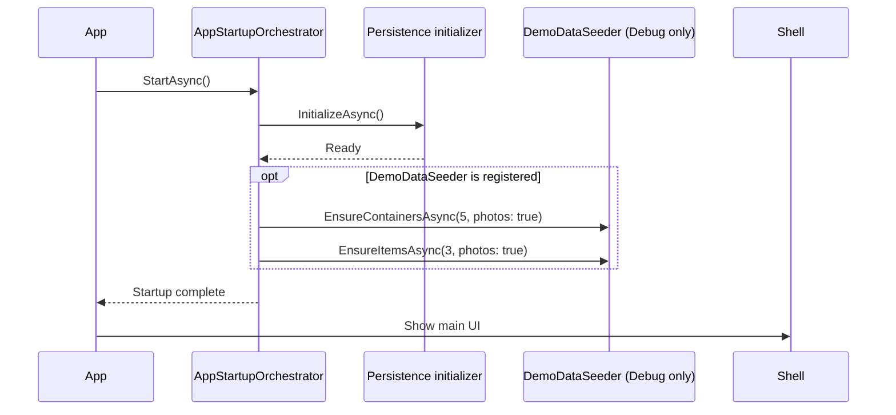

# Seeding in Mothball

This document describes development demo-data seeding and its startup boundary.

## Trigger and lifetime

`DemoDataSeeder` is registered only in Debug builds. `AppStartupOrchestrator.StartAsync()` initializes the selected persistence backend and then invokes the seeder before the main shell is shown:

1. Initialize SQLite or the JSON operational store.
2. Ensure at least five demo containers exist.
3. Ensure each seeded container has at least three demo items.
4. Continue application startup.

List pages do not seed data. `PagedListViewModelBase.InitializeAsync()` only decides whether its cached list is current and loads the first page when a reload is needed. Navigating between the item and container lists therefore does not scan or mutate the database for demo data.

Relevant files:

- Startup coordination: [src/MothballMobile/Infrastructure/Startup/AppStartupOrchestrator.cs](../src/MothballMobile/Infrastructure/Startup/AppStartupOrchestrator.cs)
- Debug registration: [src/MothballMobile/Composition/ServiceCollectionExtensions.cs](../src/MothballMobile/Composition/ServiceCollectionExtensions.cs)
- Seeder implementation: [src/Infrastructure/Services/Seeding/DemoDataSeeder.cs](../src/Infrastructure/Services/Seeding/DemoDataSeeder.cs)

## Seeder behavior

### Containers

`EnsureContainersAsync(minContainers, withPhotos)` reads the existing containers and creates only the number needed to reach `minContainers`. Seeded containers receive a marker in `Notes`:

```text
[SEED-CONTAINER-MARKER:4f3c5d11-2f9b-44b3-9e55-2e0f1ea7a8d2]
```

When photos are enabled, the seeder also creates image metadata and attempts to copy the bundled container image.

### Items

`EnsureItemsAsync(minItemsPerContainer, withPhotos)` ensures containers exist and then operates only on containers carrying the exact seed marker. It fills each seeded container up to the requested number of item relations. User-created containers are excluded and remain empty until the user explicitly assigns an item.

The seeder reuses an existing seeded item by name when possible, including an item that has become unassigned, instead of creating another item with the same seeded name. When photos are enabled, it creates image metadata and attempts to copy the bundled item image.

## Idempotency

Startup may be retried after a failure, so seeding remains idempotent:

- Containers are added only until the configured minimum is reached.
- Items are added only until each marked container reaches its configured minimum.
- Existing seeded item names are reused.
- User-created containers are never selected for automatic item assignment.

Release builds do not register `DemoDataSeeder`; the optional orchestrator dependency is then `null`, and startup performs no demo-data work.

## Sequence


