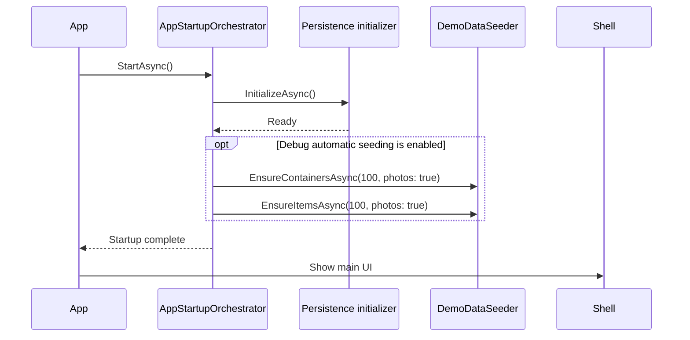

# Seeding in Mothball

This document describes development demo-data seeding and its startup boundary.

## Trigger and lifetime

`DemoDataSeeder` is available for the SQLite-backed app in all configurations. Automatic startup seeding remains Debug-only. Release users can explicitly choose **Seed demo data** from Advanced Settings after confirming the operation. `AppStartupOrchestrator.StartAsync()` initializes the selected persistence backend and, in Debug builds, then invokes the seeder before the main shell is shown:

1. Initialize SQLite or the JSON operational store.
2. Ensure at least 100 demo containers exist.
3. Ensure each seeded container has at least 100 demo items.
4. Ensure 10 demo tags exist and assign them in groups of 10 containers and groups of 10 items within each container.
5. Continue application startup.

After a successful Debug seed, the orchestrator stores the seeder version in application preferences. On later startups it performs a lightweight integrity check using the seed marker, container barcodes, and per-container item counts. If those checks pass, the expensive seeding path is skipped. A missing, changed, or invalid marker causes the normal idempotent seed to run again; the marker is written only after both container and item seeding completes successfully.

List pages do not seed data. `PagedListViewModelBase.InitializeAsync()` only decides whether its cached list is current and loads the first page when a reload is needed. Navigating between the item and container lists therefore does not scan or mutate the database for demo data.

Relevant files:

- Startup coordination: [src/MothballMobile/Infrastructure/Startup/AppStartupOrchestrator.cs](../src/MothballMobile/Infrastructure/Startup/AppStartupOrchestrator.cs)
- Debug registration: [src/MothballMobile/Composition/ServiceCollectionExtensions.cs](../src/MothballMobile/Composition/ServiceCollectionExtensions.cs)
- Seeder implementation: [src/Infrastructure/Services/Seeding/DemoDataSeeder.cs](../src/Infrastructure/Services/Seeding/DemoDataSeeder.cs)

## Seeder behavior

### Containers

`EnsureContainersAsync(minContainers, withPhotos)` reads the existing containers and creates only the number needed to reach `minContainers`. Seeded containers receive a marker in `Notes`:

```text
[SEED-CONTAINER-MARKER:4f3c5d11-2f9b-44b3-9e55-2e0f1ea7a8d2]
```

When photos are enabled, the seeder also creates image metadata and ensures the bundled default image is available.

Seeded container and item image metadata each point to one shared asset: `MothballData/Photos/Shared/seeded-container.jpg` reuses the bundled container image, while `seeded-item.jpg` reuses the bundled item/logo image. Each asset is copied at most once per seeder instance. Shared image metadata is intentionally protected from physical-file deletion; deleting a seeded photo removes only that owner’s metadata. Regular user photos continue to use their own image-ID filenames and are deleted normally.

### Items

`EnsureItemsAsync(minItemsPerContainer, withPhotos)` ensures containers exist and then operates only on containers carrying the exact seed marker. It fills each seeded container up to the requested number of item relations. User-created containers are excluded and remain empty until the user explicitly assigns an item.

Each seeded dataset also contains `Demo Tag 1` through `Demo Tag 10`. Seeded containers are ordered by their generated number and receive one tag per group of 10 containers. Within every seeded container, items are ordered by their generated number and receive one tag per group of 10 items. Tag creation and assignment are idempotent, so startup retries do not duplicate tags or assignments.

The seeder reuses an existing seeded item by name when possible, including an item that has become unassigned, instead of creating another item with the same seeded name. When photos are enabled, it creates image metadata and attempts to copy the bundled item image.

## Idempotency

Startup may be retried after a failure, so seeding remains idempotent:

- Containers are added only until the configured minimum is reached.
- Items are added only until each marked container reaches its configured minimum.
- Demo tags are created by normalized name and assignments are idempotent.
- Existing seeded item names are reused.
- User-created containers are never selected for automatic item assignment.

The persisted completion marker is a performance optimization, not the source of truth. It is versioned with the expected demo-data shape and is accepted only when the lightweight integrity check still finds the seeded containers and their minimum item counts. Deleting or partially removing seeded records therefore causes the seeder to repair them on the next Debug startup.

Release builds do not perform automatic demo-data work. The explicit Advanced Settings action uses the same idempotent seeder, so example data can be created on demand without changing normal Release startup behavior.

## Sequence


