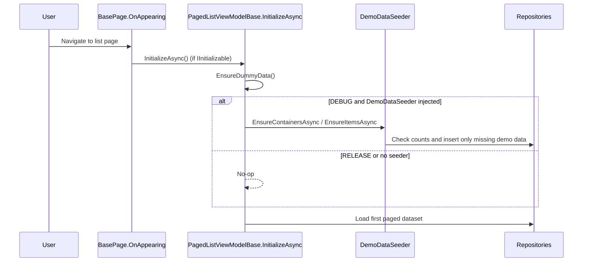

# Seeding in Mothball

This document explains where demo seeding is triggered, when it runs, and why new user-created containers should remain empty.

## TL;DR

- Seeding is **development-only** (`#if DEBUG`).
- Seeding is **not** triggered by app startup orchestrator.
- Seeding is triggered by pages whose BindingContext is a paged view model and implements `IInitializable`.
- `EnsureDummyData()` is called from `PagedListViewModelBase.InitializeAsync()` before the first page load.
- User-created containers are now excluded from item auto-seeding.
- Seed recognition uses a fixed GUID marker token in `Notes`, not only a phrase prefix.

## Core Trigger Chain

1. A page deriving from `BasePage` appears.
2. `BasePage.OnAppearing()` checks whether `BindingContext` implements `IInitializable`.
3. If yes, it calls `InitializeAsync()`.
4. For paged list view models, `InitializeAsync()` calls `EnsureDummyData()`.
5. Then paging resets and the first page of data is loaded.

### Relevant files

- `BasePage` lifecycle trigger: [src/MothballMobile/UI/Shared/BasePage.cs](../src/MothballMobile/UI/Shared/BasePage.cs)
- `EnsureDummyData` call site: [src/MothballMobile/UI/Shared/PagedListViewModelBase.cs](../src/MothballMobile/UI/Shared/PagedListViewModelBase.cs)

## Where `EnsureDummyData()` is overridden

### 1) Containers list

File: [src/MothballMobile/UI/Features/Containers/ContainersList/ContainerListViewModel.cs](../src/MothballMobile/UI/Features/Containers/ContainersList/ContainerListViewModel.cs)

Behavior:
- Calls `EnsureContainersAsync(minContainers: 5, withPhotos: true)`
- Calls `EnsureItemsAsync(minItemsPerContainer: 3, withPhotos: true)`

When:
- Whenever the Containers page appears and this VM initializes.

### 2) Items list

File: [src/MothballMobile/UI/Features/Items/ItemsList/ItemsListViewModel.cs](../src/MothballMobile/UI/Features/Items/ItemsList/ItemsListViewModel.cs)

Behavior:
- Calls `EnsureItemsAsync(minItemsPerContainer: 3, withPhotos: true)`

When:
- Whenever the Items page appears.
- Also when `RefreshCommand` calls `InitializeAsync()`.

### 3) Associate item with container

File: [src/MothballMobile/UI/Features/Containers/AssociateItemWithContainer/AssociateItemWithContainerViewModel.cs](../src/MothballMobile/UI/Features/Containers/AssociateItemWithContainer/AssociateItemWithContainerViewModel.cs)

Behavior:
- Calls `EnsureContainersAsync(minContainers: 5, withPhotos: true)` only.

When:
- Whenever the associate page appears.

### 4) Add existing item to container

File: [src/MothballMobile/UI/Features/Containers/AddExistingItemToContainer/AddExistingItemToContainerViewModel.cs](../src/MothballMobile/UI/Features/Containers/AddExistingItemToContainer/AddExistingItemToContainerViewModel.cs)

Behavior:
- `EnsureDummyData()` returns completed task.
- No seeding.

## Debug vs Release

`DemoDataSeeder` is only registered in DI in DEBUG:

- Registration: [src/MothballMobile/Composition/ServiceCollectionExtensions.cs](../src/MothballMobile/Composition/ServiceCollectionExtensions.cs)

Meaning:
- **Debug build**: seeder instance is injected and seeding can run.
- **Release build**: seeder is not registered, injected parameter is `null`, and each `EnsureDummyData` block skips seeding.

## What `DemoDataSeeder` actually does

File: [src/Infrastructure/Services/Seeding/DemoDataSeeder.cs](../src/Infrastructure/Services/Seeding/DemoDataSeeder.cs)

### `EnsureContainersAsync(minContainers, withPhotos)`

- Ensures repository/table initialization.
- Reads all containers.
- If current count is below `minContainers`, creates missing containers.
- New seeded containers get:
  - `Name = "Container N"`
    - `Notes = "Seeded notes for container ... [SEED-CONTAINER-MARKER:4f3c5d11-2f9b-44b3-9e55-2e0f1ea7a8d2]"`
- Optionally adds one photo entry + copies `container.png`.

### `EnsureItemsAsync(minItemsPerContainer, withPhotos)`

- Ensures table initialization.
- Ensures there are containers (creates a few if needed).
- **Important current behavior**: seeds items only for containers recognized as seeded containers.
- For each seeded container, ensures at least `minItemsPerContainer` relations.
- Optionally adds one photo per seeded item + attempts to copy `mothball_logo.png`.

Seeded-container recognition:
- `container.Notes` contains `[SEED-CONTAINER-MARKER:4f3c5d11-2f9b-44b3-9e55-2e0f1ea7a8d2]`.
- A manual note that only copies the text phrase is **not** enough.

## Why the bug happened before

Before the fix, `EnsureItemsAsync()` iterated over all containers, including user-created ones. Since list pages call `EnsureDummyData()` during initialization, simply returning to a list could backfill new containers up to 3 items.

## Why new containers are empty now

Now `EnsureItemsAsync()` filters to seeded containers only. User-created containers are not in that set, so they remain empty until a user explicitly adds items.

## Idempotency and repeated triggers

Seeding can be triggered multiple times in debug because page initialization can happen multiple times. This is expected.

Why it does not grow infinitely:
- Container seeding only fills up to `minContainers`.
- Item seeding only fills seeded containers up to `minItemsPerContainer`.
- Once limits are met, subsequent calls do no additional inserts.

## Sequence Diagram

